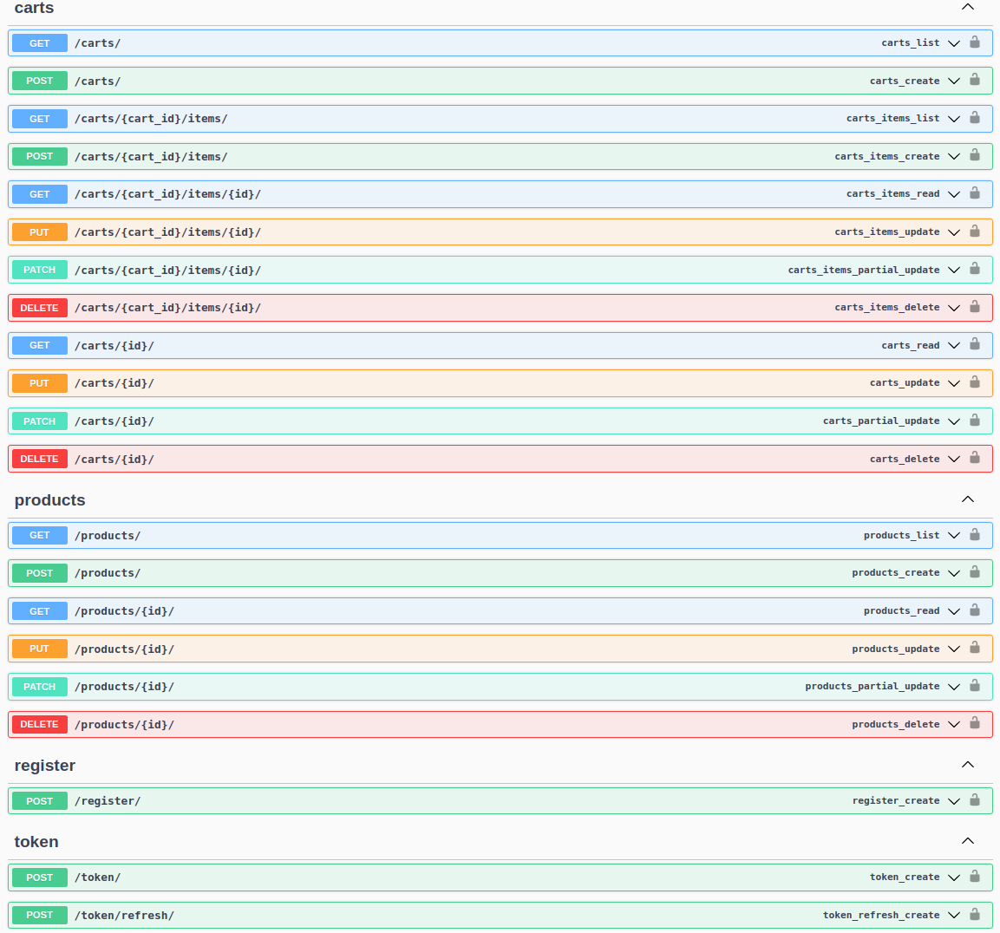

# e-commerce-cart

## Requirements
  * Docker
  * docker-compose

## Setup

    & make start-dev

API will be on http://0.0.0.0:8000/api/

Frontend login at http://0.0.0.0:3000/

PostgreSQL will be on

## Caveats

* Frontend app (attempt) is based on research, not my knowledge about React. It's just a draft.
* Due to lack of practice I didn't follow TDD even though I'm passionated about it.
* All views are restricted to authenticated users and it might be trick to access. I did it sometimes using Postman (or Insomnia) and passing Authorization token in header.
* Swagger was just installed to get endpoint screenshot and openapi.json.

